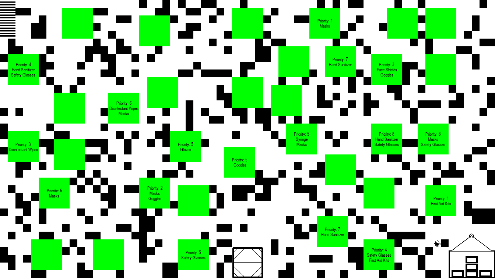

# 🔬 Laboratory Layout Planner and Operator

> A simulator featuring rule-based agents that design, analyze, and simulate operator navigation within a laboratory environment.

This project provides system for generating laboratory layouts, planning efficient delivery routes, and simulating a robot operator's behavior in real-time. It leverages three distinct agents—a **Planner**, an **Order Manager**, and an **Operator** — to handle different aspects of the simulation. The system is visualized using the Pygame library, with visual assets created in Adobe Illustrator.

<br>
<br>



---
## ✨ Core Features

* **Automatic Layout Generation**: Procedurally generates a grid-based laboratory map, placing rooms, a warehouse, a docking station, and obstacles. The obstacle density is an adjustable parameter.
* **A\* Pathfinding**: Implements the A\* search algorithm to find the shortest feasible path for the robot. It uses the **Manhattan distance** as its heuristic to minimize path cost on the grid.
* **Intelligent Order Planning**: A dedicated agent generates delivery orders for reachable rooms, assigning items from a predefined list and a random priority number to each order.
* **Real-Time Delivery Simulation**: A Pygame window visualizes the entire process. The simulation animates the robot as it moves from the docking station to the warehouse to pick up items and deliver them to rooms based on priority.
* **Layout Complexity Analysis**: Before the simulation starts, the system calculates and displays key metrics in the terminal, including the number of unreachable rooms and the minimal and average path lengths to reachable rooms.

---
## 🤖 The Three-Agent Architecture

The system's logic is structured around three interconnected, rule-based agents, each represented by a Python class:

1.  **`LaboratoryPlanner`**: Responsible for generating the grid, placing all fixed zones (warehouse, docking station), randomly placing rooms, and adding obstacles. It then analyzes the layout's complexity and accessibility.
2.  **`OrderPlanner`**: Generates orders, assigns them to reachable rooms, and sets delivery priorities. It uses data from the `LaboratoryPlanner` to ensure orders are only created for valid locations.
3.  **`LaboratoryOperator`**: The simulation agent. It fetches delivery batches from the `OrderPlanner`, uses the A\* algorithm to navigate the layout provided by the `LaboratoryPlanner`, and visualizes the robot's movement and actions.

These agents interact following the Dependency Inversion Principle, where higher-level components depend on abstractions, not on concrete implementations of lower-level components.

---
## 🛠️ Technologies Used

* **Language**: Python 3.12.6
* **Libraries**:
    * **Pygame**: For creating the 2D visualization and animating the robot.
    * **NumPy**: Used for efficient grid creation and mathematical operations.
* **Environment**:
    * **OS**: Windows
    * **Code Editor**: Visual Studio Code

---
## 🚀 Getting Started

### Prerequisites

Ensure you have **Python 3.12** or newer installed on your system.

### Installation & Setup

1.  **Clone the repository:**
    ```sh
    git clone [https://github.com/prosckol/lab-planner.git](https://github.com/prosckol/lab-planner.git)
    cd lab-planner
    ```

2.  **Create and activate a virtual environment:**
    ```sh
    # For Windows
    python -m venv venv
    .\venv\Scripts\activate
    ```

3.  **Install the required dependencies:**
    ```sh
    pip install -r requirements.txt
    ```

### Running the Simulation

1.  **Execute the main script from your terminal:**
    ```sh
    python main.py
    ```

2.  **Provide input:** The program will prompt you to enter the desired **number of rooms**.

3.  **Observe the output:**
    * First, a **layout complexity analysis** will be printed in your terminal.
    * Then, a **Pygame window** will open to display the visual simulation. The robot starts at the docking station, travels to the warehouse to pick up items, and delivers them to rooms according to priority.

---
## ⌨️ Interactive Controls

While the simulation window is active, you can use the following keys:

* **`SPACEBAR`**: Pause or resume the simulation.
* **`l`**: Toggle the robot's current inventory display in the console.
* **`s`**: Save a screenshot of the current simulation state.